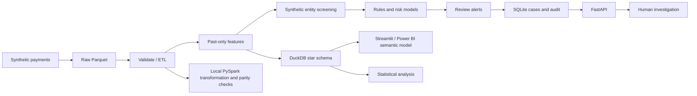
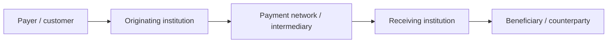
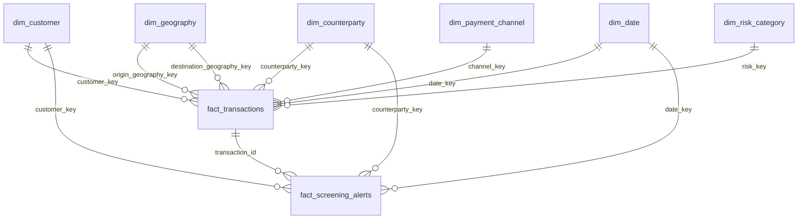
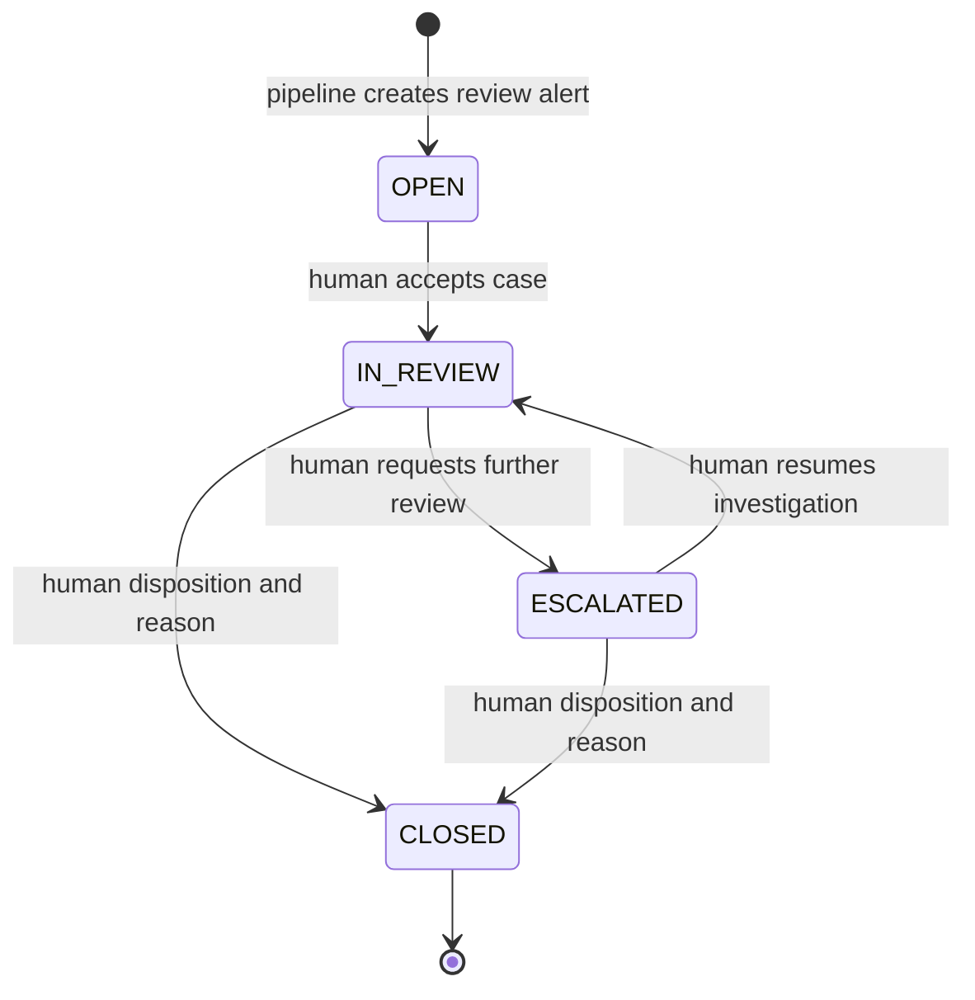

# Architecture

FinCrimeAI is an educational local batch system. The pipeline processes synthetic GBP
payments; no bank, payment network, cloud account or public sanctions service is connected.

The logical diagram separates capabilities. Actual batch order is generation → validation
→ counterparty screening → feature generation → rules → model fitting/scoring → cases
→ warehouse → exports/reports. This makes scored facts available in one atomic rebuild.

## Conceptual payment flow

`account_id`, `customer_id`, originating_bank, network, beneficiary_bank and counterparty_id
represent each stage. Currency is GBP throughout; there is no FX netting or settlement engine.
Status is simulated payment metadata, independent of investigation disposition.

## Dimensional warehouse

## Investigation workflow

Each transition records actor, action, UTC timestamp, complete before/after state in the
same SQLite transaction. Closed cases cannot be silently reopened. Actor names are
self-asserted in this local demo; they are not authenticated identities.

## Storage, lineage and incremental concept

Raw Parquet is deterministic for a seed and environment. Processed data includes observable
features and separated truth/evaluation fields. The run manifest records input hash,
control hash, versions, seed, record count and maximum event-time watermark. Warehouse
rebuilds validate row/amount reconciliation before atomic replacement. Primary keys reject
duplicates. Case inserts are idempotent and preserve previous human review states for an
identical run key. This is an incremental-style case pattern, not a streaming ETL claim.

## Spark and Pandas

The default, fully exercised path uses Pandas. `spark_pipeline.py` is a dedicated optional
local Spark transformation (read Parquet, validate positive amounts, derive date/log amount,
deduplicate transaction IDs). It executed on 100000 rows in local[2] mode. Native Windows
Hadoop export failed without winutils; a bounded 10000-row PyArrow writer exported the
Spark results. ID, amount, log-amount, date and count parity checks passed. See
reports/spark_validation.json. It does not substitute Spark for model training or the entire pipeline.

## Zero-charge AWS mapping

| Local layer | Conceptual AWS equivalent |
|---|---|
| data/raw | S3 raw prefix |
| data/processed | S3 processed prefix |
| data/curated | S3 curated prefix / Athena tables |
| local transform | Glue Spark job |
| DuckDB analytics | Athena or Redshift analytical model |
| API and local audit | Private service and access-controlled database |

`storage.s3_uri` only maps logical locations. It performs no uploads, credential discovery
or network requests. Cloud deployment is documented, not implemented or validated.

## Operational boundaries

Bind both servers to loopback. Restart servers after pipeline regeneration to invalidate
model/data caches. Stop readers before rebuilding the warehouse on Windows. Warehouse
case statuses are snapshots from the last run; Streamlit investigation and API use live
SQLite state. Do not edit controls under a running server. No PostgreSQL integration,
production authentication, scheduling, distributed locks or real compliance controls are claimed.
