# FinCrimeAI

**End-to-end synthetic financial crime screening and payment-risk analytics platform using Python, PySpark, XGBoost, DuckDB, FastAPI, Streamlit and Power BI semantic modeling.**


[](https://github.com/Pranjal3002/fincrime-ai/actions/workflows/ci.yml)
[](LICENSE)

Turn synthetic payments into explainable review alerts, measurable risk models and an auditable human investigation workflow.

**100,000 synthetic payments · 21,998 review alerts · 29 passing tests.** Synthetic benchmark results do not represent production financial-crime performance.

**Streamlit — Executive Financial Crime Analytics**

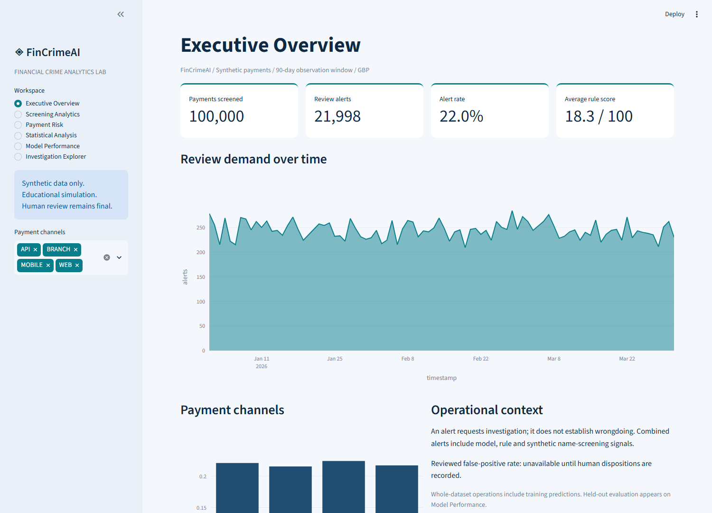

## Project at a Glance

| Metric | Verified result |
|---|---:|
| Synthetic payments | 100,000 |
| Customers | 2,000 |
| Counterparties | 600 |
| Watchlist entities | 20 |
| Review alerts | 21,998 |
| Warehouse tables | 8 |
| Enforced foreign keys | 11 |
| Automated tests | 29 |
| XGBoost PR-AUC | 0.7471 |
| Screening F1 | 0.9605 |

All model and screening metrics are based on controlled synthetic ground truth and are not representative of production financial-crime systems.

[Evidence index](docs/EVIDENCE.md) · [Executive report](reports/EXECUTIVE_FINCRIME_ANALYTICS_REPORT.md) · [Model card](MODEL_CARD.md) · [Delivery status](FINAL_STATUS.md)

## Why This Project Exists

FinCrimeAI demonstrates the engineering and analytical decisions behind a local financial-crime review system: validated data, explainable screening, temporal model evaluation and traceable case transitions. Every customer, payment and watchlist entity is synthetic.

## Technology Stack

| Area | Implemented capabilities |
|---|---|
| Data engineering | Python, SQL, PySpark, DuckDB, ETL, validation, reconciliation and lineage |
| Data science | Pandas, NumPy, scikit-learn, XGBoost, statistical testing and past-only feature engineering |
| Financial crime analytics | Watchlist screening, fuzzy matching, transaction rules, reason codes and alert workflows |
| Backend / BI | FastAPI, six Streamlit views, native Power BI semantic-model source |
| Quality | pytest, Ruff, Black and a GitHub Actions workflow |

## Architecture

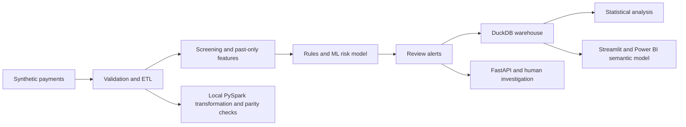
```mermaid
flowchart LR
  A[Synthetic payments] --> B[Validation and ETL]
  B --> C[Screening and past-only features]
  C --> D[Rules and ML risk model]
  D --> E[Review alerts]
  E --> F[DuckDB warehouse]
  F --> G[Statistical analysis]
  F --> H[Streamlit and Power BI semantic model]
  E --> I[FastAPI and human investigation]
  B --> J[Local PySpark transformation and parity checks]
```

The main batch pipeline uses Pandas. PySpark executes a separate, validated local transformation over the same 100,000 payments. See [architecture and operational boundaries](ARCHITECTURE.md).

## Payment Flow

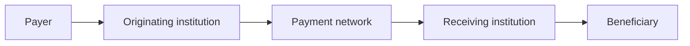
```mermaid
flowchart LR
  A[Payer] --> B[Originating institution]
  B --> C[Payment network]
  C --> D[Receiving institution]
  D --> E[Beneficiary]
```

These stages are synthetic metadata; no bank or payment network is connected.

## Synthetic Dataset

100,000 GBP payments across 90 days, 2,000 customers, 600 counterparties and 20 fictional watchlist entities. Seed 42 produces normal activity and injected risk patterns with separate evaluation labels. [Small synthetic samples](data/samples/README.md) are included; full datasets and serialized models are regenerated locally.

## Data Engineering & PySpark

Generation → validation → screening → past-only features → rule/model scoring → cases → warehouse → analytical exports. Hashes, seed, versions and event-time watermark are recorded in the [run manifest](reports/run_manifest.json). Duplicate keys, invalid values and reconciliation errors fail validation.

[PySpark evidence](reports/spark_validation.json) records real local compute and parity checks. On Windows, computed Spark rows were exported through bounded PyArrow batches because native Hadoop output required unavailable Windows utilities.

## Dimensional Warehouse

The [DuckDB warehouse](DATA_MODEL.md) has two facts and six dimensions, with **11 enforced foreign keys**. Transaction facts reconcile to input row counts and GBP totals. Case creation is idempotent; the warehouse is a refreshed analytical snapshot.

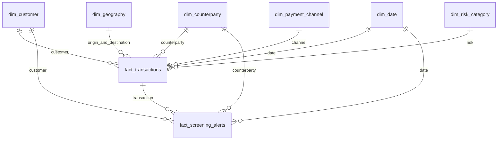
```mermaid
erDiagram
  dim_customer ||--o{ fact_transactions : customer
  dim_counterparty ||--o{ fact_transactions : counterparty
  dim_date ||--o{ fact_transactions : date
  dim_geography ||--o{ fact_transactions : origin_and_destination
  dim_payment_channel ||--o{ fact_transactions : channel
  dim_risk_category ||--o{ fact_transactions : risk
  fact_transactions ||--o{ fact_screening_alerts : transaction
  dim_customer ||--o{ fact_screening_alerts : customer
  dim_counterparty ||--o{ fact_screening_alerts : counterparty
  dim_date ||--o{ fact_screening_alerts : date
```

The geography edge represents two foreign keys; [full schema](sql/schema/star.sql).

## Financial Crime Screening

Entity normalization, exact/alias matching and fuzzy comparison produce match scores and reason codes against a fictional watchlist. [Screening rules](SCREENING_RULES.md) keep entity-screening results distinct from transaction-risk labels. A match means review, never a legal determination.

## Payment Risk Analytics

Rules cover unusual amounts, payment velocity, cross-border activity, fictional high-risk geographies and screening matches. Observable features feed risk scores and explanations. Evaluation-only synthetic labels are excluded from model inputs.

## Statistical Analysis

| Analysis | Recorded finding |
|---|---|
| Chi-square | Cramér's V = 0.1101 for geography-risk group vs alert flag |
| Mann–Whitney U | Alerted/non-alerted amounts: rank-biserial effect size = 0.5110 |
| Wilson interval | Alert-rate 95% interval: 21.742%–22.256% |
| Spearman correlation | Amount vs risk score: ρ = 0.3292 |

[Statistical analysis](STATISTICAL_ANALYSIS.md) includes assumptions and effect sizes. Repeated synthetic customer activity limits independence; associations are not causal findings.

## Machine Learning

Logistic Regression, Random Forest and XGBoost use a chronological **60,000 / 20,000 / 20,000** train/validation/test split. Class weighting addresses imbalance. Model and threshold selection minimize validation `5 × FN + FP`; the held-out test set is not used for selection. See [model card](MODEL_CARD.md).

## Explainability

Rules emit human-readable reason codes. The selected XGBoost model supplies global importance and per-payment additive contributions in log-odds space, with additivity checked. [Feature importance](reports/feature_importance.csv) and [investigation evidence](docs/images/08_alert_investigation.png) link scores to observable signals; they do not establish causality.

## Investigation Workflow

`OPEN → IN_REVIEW → ESCALATED / CLOSED` transitions require explicit human actions and write before/after audit records atomically. Closed cases cannot silently reopen. Summary assistance uses deterministic templates; no language model inference is claimed. See the [workflow diagram](ARCHITECTURE.md#investigation-workflow).

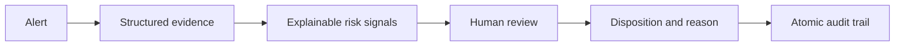
```mermaid
flowchart LR
  A[Alert] --> B[Structured evidence]
  B --> C[Explainable risk signals]
  C --> D[Human review]
  D --> E[Disposition and reason]
  E --> F[Atomic audit trail]
```

## Streamlit Analytics

Six completed views: executive overview, screening analytics, payment risk, model performance, statistical analysis and alert investigation.

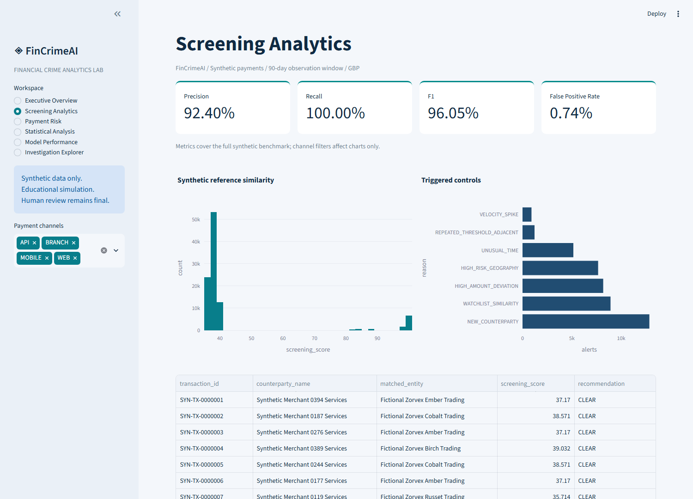

## Power BI Semantic Model

A native **Power BI Project (PBIP)** is included: **15 tables, 15 active one-to-many relationship definitions and 38 DAX measures**. Seven conformed dimensions filter both facts in one direction; an alert-to-rule bridge supports rule analysis. This BI model is distinct from the 8-table DuckDB warehouse.

Static validation confirms relationship endpoints, cardinalities and project references. This excerpt shows the semantic layer's conformed-customer and rule-bridge pattern; the screenshot and model source show the wider model.

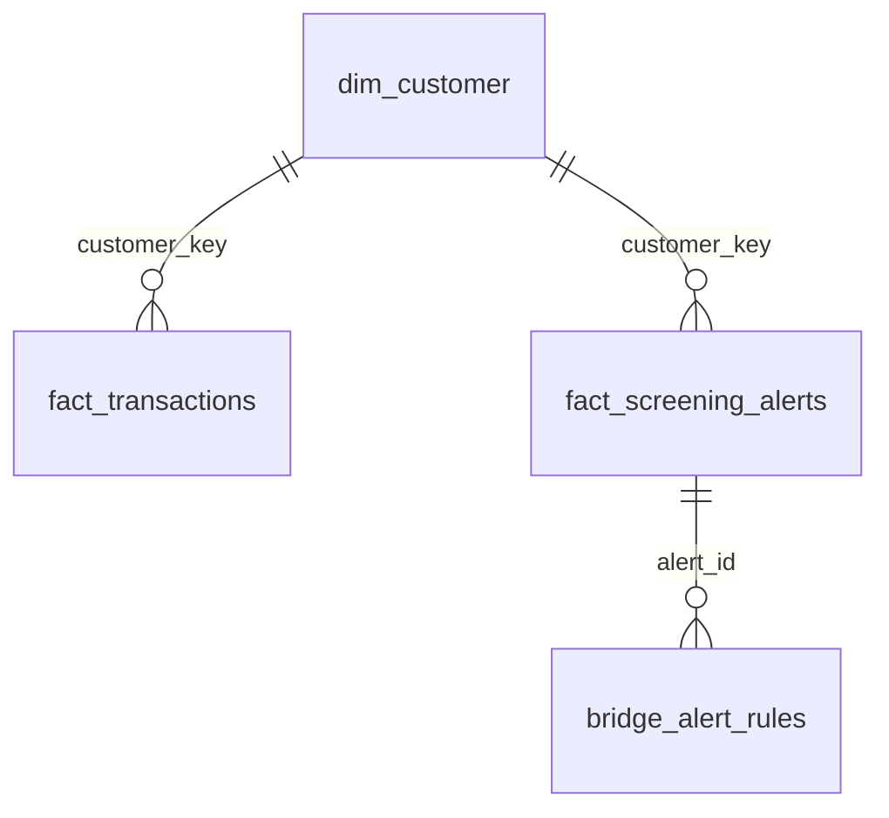
```mermaid
erDiagram
  dim_customer ||--o{ fact_transactions : customer_key
  dim_customer ||--o{ fact_screening_alerts : customer_key
  fact_screening_alerts ||--o{ bridge_alert_rules : alert_id
```

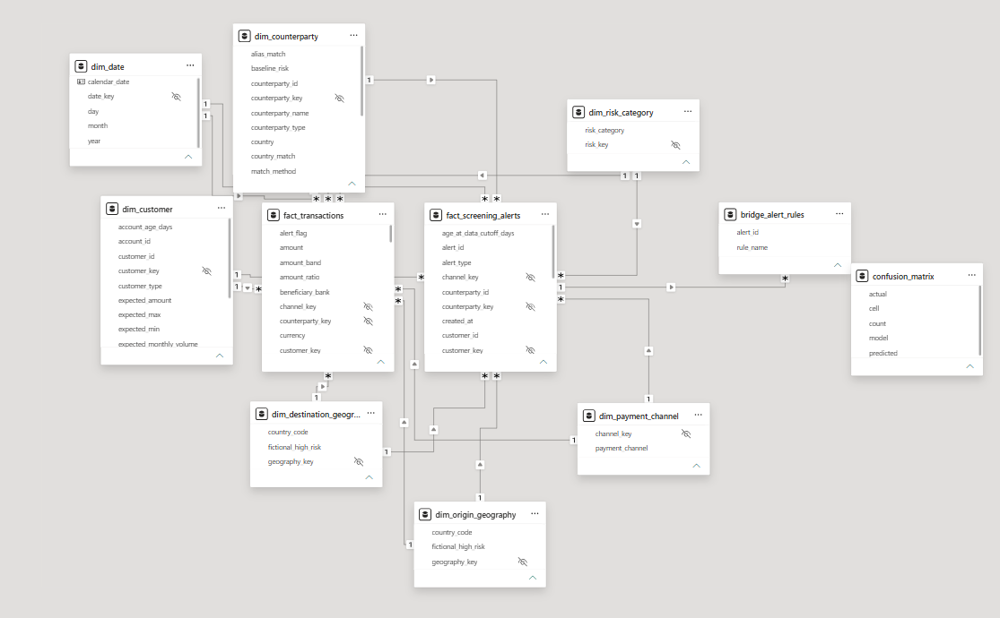

*Power BI — Financial Crime semantic model with active one-to-many relationships and conformed dimensions.*

```text
dashboards/powerbi/
├── FinCrimeAI_Financial_Crime_Analytics.pbip
├── FinCrimeAI_Financial_Crime_Analytics.Report/
└── FinCrimeAI_Financial_Crime_Analytics.SemanticModel/
```

**Partial delivery:** model view opens locally, but report-page rendering is limited by local WebView2 behavior. Experimental page definitions are preserved; rendered pages, displayed-total reconciliation and a finished PBIX are **not** claimed. DAX is verified as source, not as fully validated report output. No cloud publishing or sign-in is required for the local workflow. [Open/refresh instructions](dashboards/powerbi/README.md) · [Power BI evidence](dashboards/powerbi/POWERBI_EVIDENCE.md).

## FastAPI

Local endpoints expose health, entity screening, transaction scoring, alerts, model metrics and investigation actions. Typed request validation and tests cover API behavior. [Actual Swagger UI](docs/images/09_fastapi_docs.png) is available after startup at `http://127.0.0.1:8000/docs`.

## Model Results

<!-- MODEL_RESULTS_START -->

| Model | Precision | Recall | F1 | ROC-AUC | PR-AUC (AP) |
|---|---:|---:|---:|---:|---:|
| Logistic Regression | 0.627404 | 0.716183 | 0.668861 | 0.866433 | 0.686357 |
| Random Forest | 0.613824 | 0.746273 | 0.673599 | 0.877913 | 0.727399 |
| **XGBoost** | 0.696420 | 0.748712 | 0.721620 | 0.885037 | 0.747059 |

<!-- MODEL_RESULTS_END -->

XGBoost was selected at threshold **0.45**. Test confusion matrix: **TP 2,762 · FP 1,204 · FN 927 · TN 15,107**. PR-AUC denotes average precision. [Recorded metrics](reports/model_metrics.json) include split boundaries and validation costs.

## Screening Results

<!-- SCREENING_RESULTS_START -->

| Metric | Result |
|---|---:|
| Precision | 0.9240 |
| Recall | 1.0000 |
| F1 | 0.9605 |
| False Positive Rate | 0.0074 |
| False Negative Rate | 0.0000 |

<!-- SCREENING_RESULTS_END -->

**Controlled synthetic benchmark only.** These are transaction-weighted entity-screening results, not the ML risk-label evaluation. Repeated counterparties contribute multiple payments. [Unique-entity results](reports/screening_metrics.json) are also recorded.

## Testing & Quality

**29 local tests pass**, including temporal features, leakage controls, screening, warehouse constraints, API behavior and transactional case audit. Ruff, Black and dependency validation pass. [Validation output](reports/validation_results.json) records the commands and results.

[GitHub Actions](.github/workflows/ci.yml) installs dependencies and runs Ruff, Black and pytest on Windows and Ubuntu. The [live CI results](https://github.com/Pranjal3002/fincrime-ai/actions/workflows/ci.yml) show hosted execution for each pushed revision. Tests do not require Power BI, a Spark cluster, Microsoft login or external APIs.

## Evidence Gallery

### Analytics

| Streamlit payment/geographic risk | Streamlit model performance |
|---|---|
| 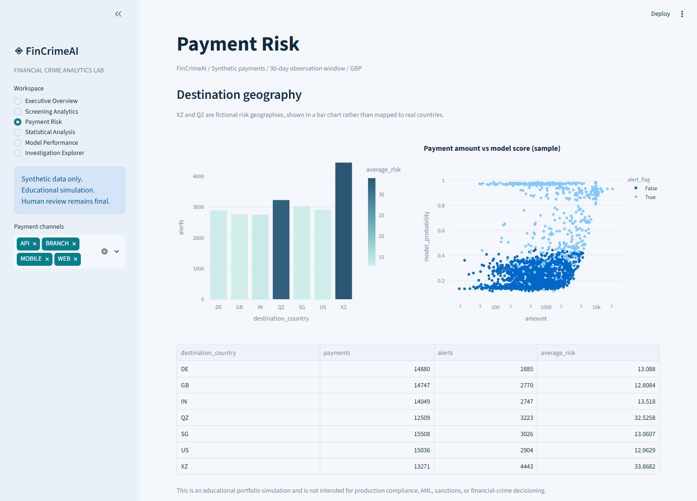 | 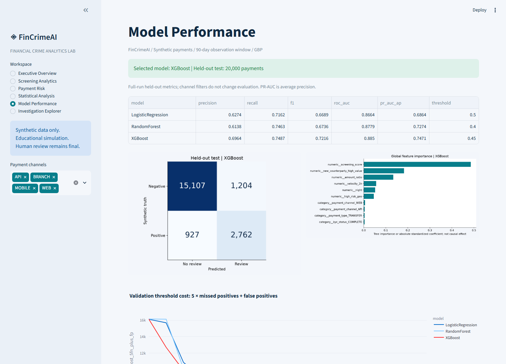 |

### Modeling

| Held-out confusion matrix | Recorded feature importance |
|---|---|
| 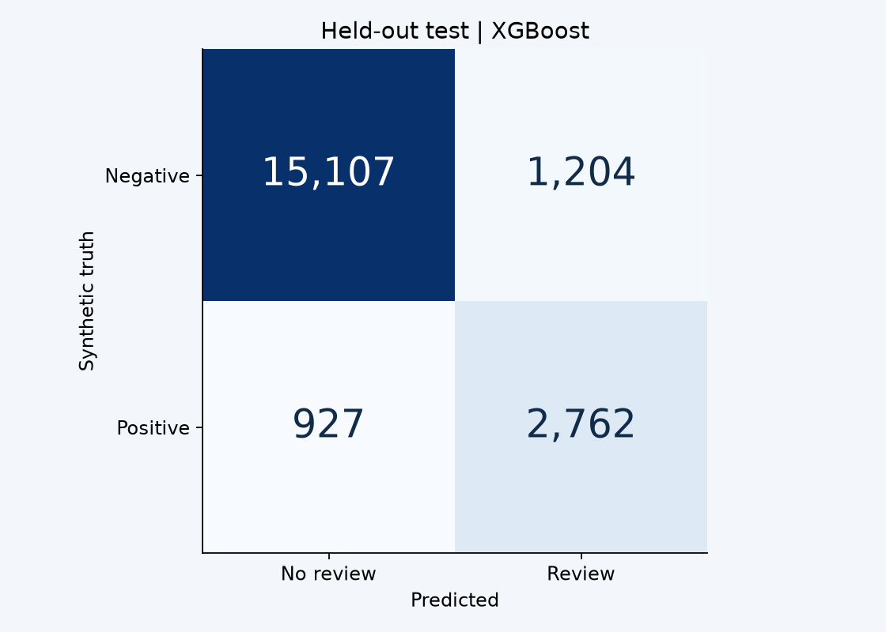 | 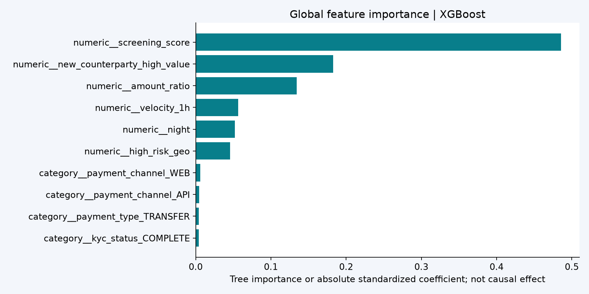 |

| Streamlit statistical analysis | Streamlit alert investigation |
|---|---|
| 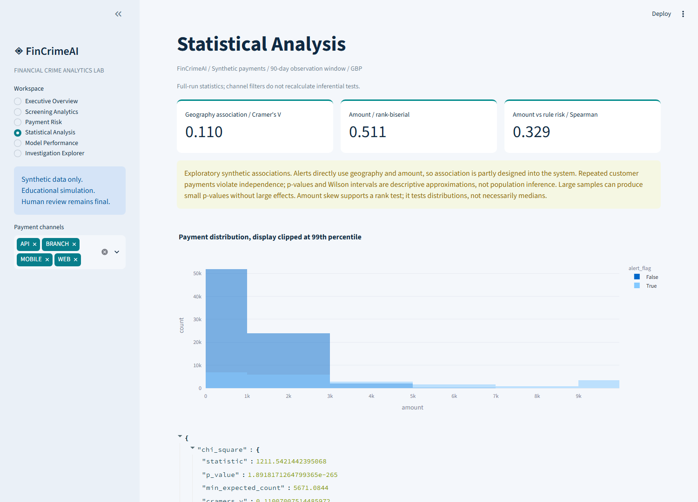 | 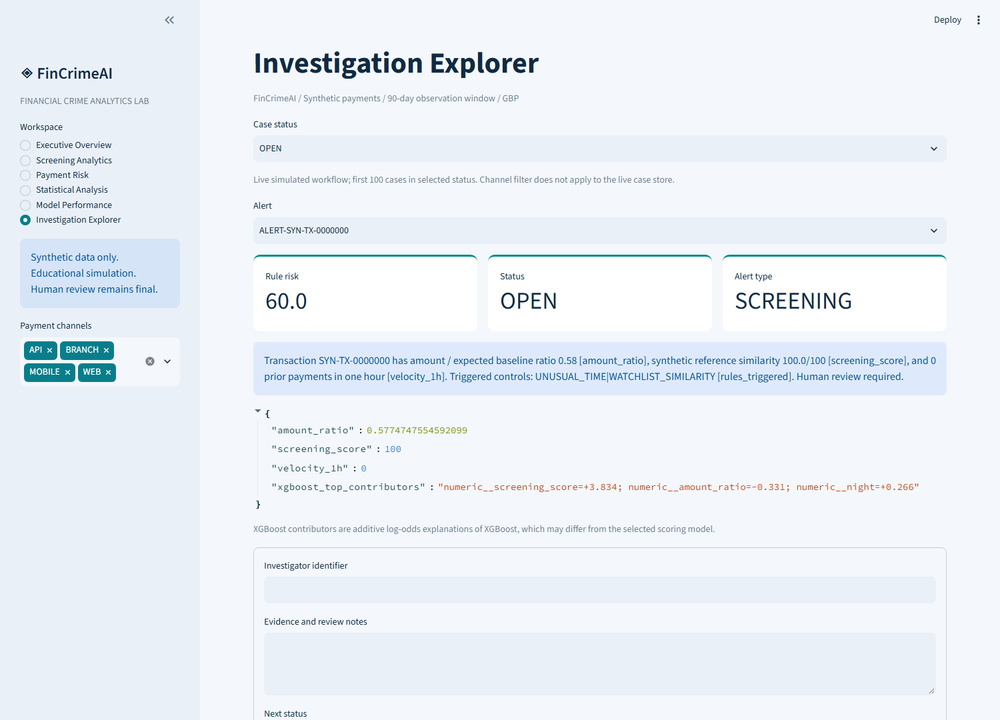 |

### Engineering

| FastAPI — actual Swagger UI | Tests — actual output transcript |
|---|---|
| 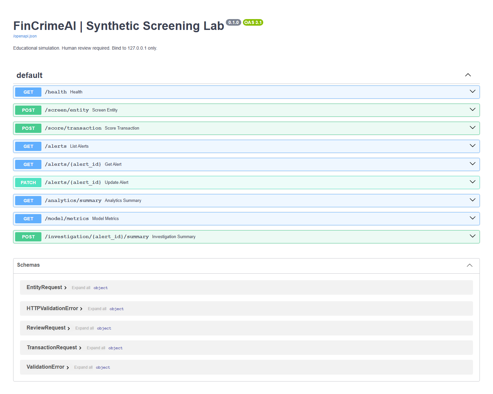 | 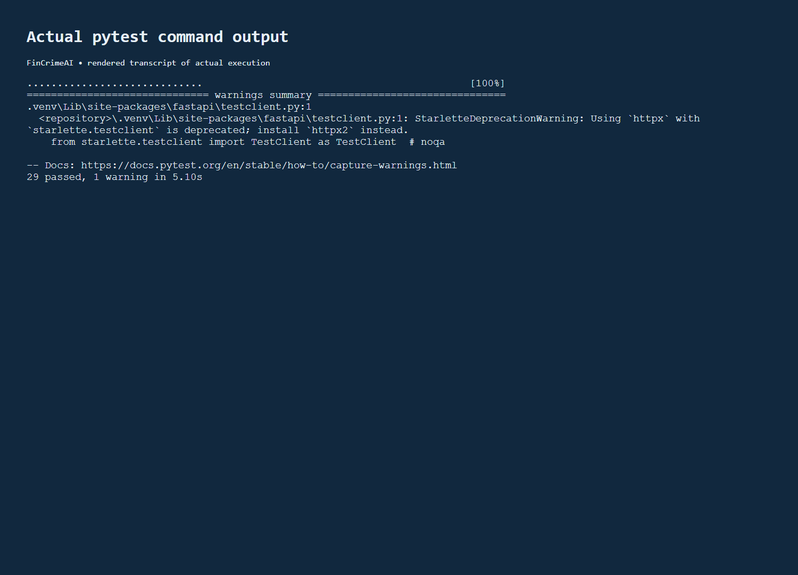 |

| Pipeline — actual output transcript | DuckDB — actual schema introspection |
|---|---|
| 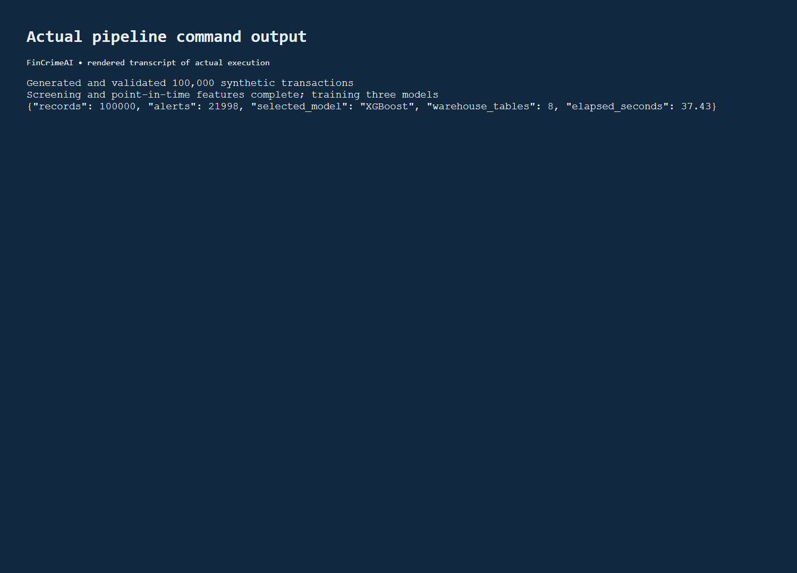 | 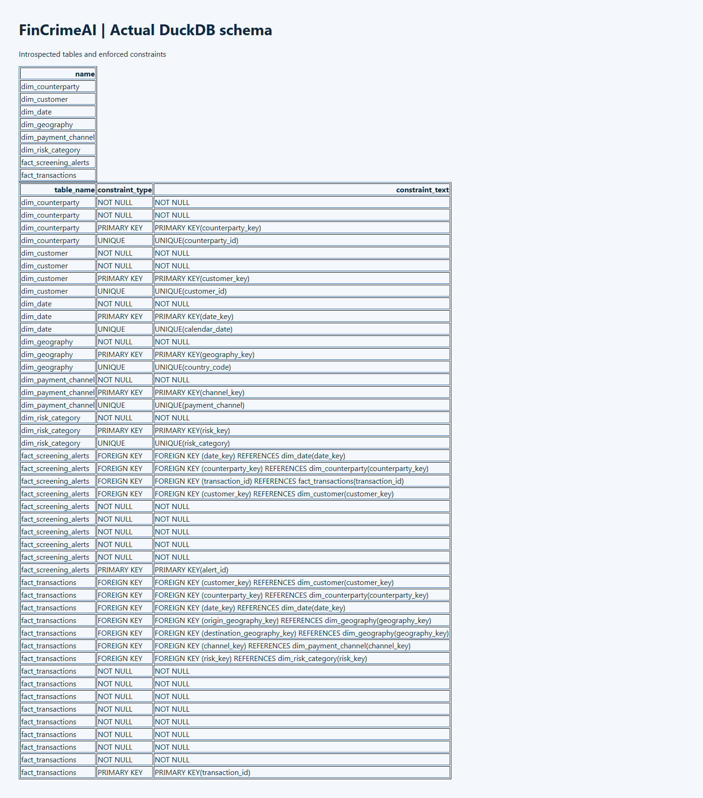 |

### Power BI

[Native semantic-model view](docs/images/powerbi_model.png). All 13 evidence assets are mapped to their real sources in the [evidence index](docs/EVIDENCE.md); transcript images are explicitly identified as rendered command output.

## How to Run

Python 3.11; Windows PowerShell from the repository root:

```powershell
python -m venv .venv
.\.venv\Scripts\Activate.ps1
python -m pip install -r requirements-lock.txt
python -m pip install -e .
python scripts/run_all.py --transactions 100000 --seed 42
```

Start each service in its own activated terminal:

```powershell
uvicorn api.main:app --host 127.0.0.1 --port 8000
streamlit run dashboards/streamlit/app.py --server.address 127.0.0.1
```

```powershell
python -m pytest -q
python -m ruff check .
python -m black --check .
python scripts/check_repository.py
```

On Linux/macOS, activate with `source .venv/bin/activate`. Stop services before regenerating data; restart to refresh cached models. Optional Spark and screenshot tools are separate in [environment notes](docs/ENVIRONMENT.md).

## Repository Structure

```text
api/                  Typed local FastAPI services
config/               Synthetic controls and risk configuration
dashboards/           Streamlit app, Power BI model, Tableau specifications
data/samples/         Small synthetic CSV examples
docs/                 Evidence, images, environment and resume bullets
reports/              Recorded metrics, validation and executive analysis
scripts/              Reproducible runs, exports and repository checks
sql/                  Warehouse schema and analytical queries
src/fincrime_ai/       ETL, screening, statistics, ML and investigation
tests/                Automated behavior and integration checks
```

Full generated datasets, fitted model binaries, caches and local case stores stay out of Git. The [MIT license](LICENSE) covers project code; dependencies retain their own licenses.

**Technical review:** [Architecture](ARCHITECTURE.md) · [Data model](DATA_MODEL.md) · [Model card](MODEL_CARD.md) · [Statistics](STATISTICAL_ANALYSIS.md) · [Screening rules](SCREENING_RULES.md) · [Evidence](docs/EVIDENCE.md) · [Resume bullets](docs/RESUME_BULLETS.md) · [Power BI](dashboards/powerbi/README.md) · [Executive report](reports/EXECUTIVE_FINCRIME_ANALYTICS_REPORT.md) · [Compliance boundaries](COMPLIANCE_BOUNDARIES.md).

## Safety / Compliance Boundary

**Educational synthetic demonstration only — not a production screening system, legal advice or a compliance certification.** No real PII, live watchlist, banking integration or automated adverse action. Human review remains required. No bank affiliation is claimed. [Full boundaries](COMPLIANCE_BOUNDARIES.md).

## Known Limitations

- Synthetic ground truth does not measure real-world detection performance; expected-amount baselines are simulated.
- Local APIs lack production authentication; investigator identities are self-asserted.
- Warehouse case states and BI exports are snapshots; investigation uses the live local case store.
- Power BI semantic modeling is evidenced; rendered report pages and finished PBIX remain incomplete. Tableau is specifications only.
- Spark is a local transformation, AWS is a conceptual mapping, and investigation summaries are templates.

## Future Work

Validate rendered Power BI pages and refresh reconciliation; evaluate on independently governed data; add authenticated case access, calibration and drift monitoring. These are future work, not completed features.
